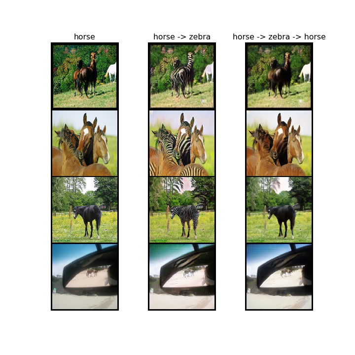
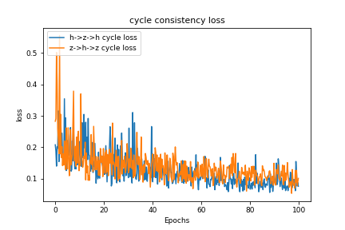

# cycleGAN-pytorch
A pytorch implementation of "Unpaired Image-to-Image Translation using Cycle-Consistent Adversarial Networks"

## Results

horse to zebra, zebra to horse

zebra to horse, horse to zebra

horse to zebra adversarial losses

zebra to horse adversarial losses

cycle consistency losses

